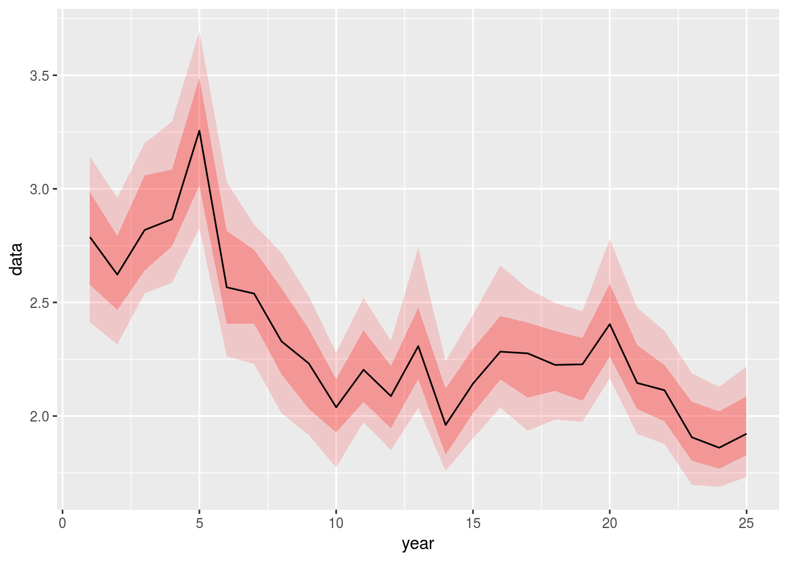

```{r setup, include=FALSE}
##------------------------------------------------------------------------------------------------------------
## Created by: Thomas Speidel
##------------------------------------------------------------------------------------------------------------

##------------------------------------------------------------------------------------------------------------
## Set common options
##------------------------------------------------------------------------------------------------------------
## Invalidate cache when the package version changes
options(htmltools.dir.version = FALSE)

## Global options
options(tinytex.verbose = TRUE)
options(max.print = "90")
options(width = 90)
knitr::opts_knit$set(eval.after = 'fig.cap')
knitr::opts_knit$set(width = 90)

knitr::opts_chunk$set(dev         = 'CairoPNG', 
                      echo        = FALSE, 
                      warning     = FALSE, 
                      message     = FALSE, 
                      fig.path    = 'Figures/', ##This creates the Figures dir and places all R generated figures in it
                      fig.align   = 'center',
                      dpi         = 144,
                      strip.white = TRUE)

## Turn off scientific notation
options(scipen = 999)

##------------------------------------------------------------------------------------------------------------
# Set pretty looking numbers
##------------------------------------------------------------------------------------------------------------
knitr::knit_hooks$set(inline = function(x) {
      if(is.numeric(x)){
          return(prettyNum(x, big.mark=","))
      }else{
          return(x)
       }
   })

##------------------------------------------------------------------------------------------------------------
# Allow font awesome icons
##------------------------------------------------------------------------------------------------------------
htmltools::tagList(rmarkdown::html_dependency_font_awesome())


##------------------------------------------------------------------------------------------------------------
## LOAD PACKAGES
##------------------------------------------------------------------------------------------------------------
library(lubridate)
library(dplyr)
library(readr)
library(readxl)
library(scales) 
library(viridis)
library(tidyr)
library(ggplot2)
library(extrafont)
library(viridis)
library(knitr)
library(Hmisc)
library(rms)
library(kableExtra)
library(forcats)
library(patchwork)
library(GGally)
library(htmltools)
library(ggmap)
library(lubridate)
library(htmlwidgets)
library(leaflet)

## Fonts
# font_import(pattern="[R/r]oboto")
# loadfonts(device="win")

```


class: inverse

# Agenda

<br>


In this presentation, I will provide an overview of the role that visualizations play in today's world of Big Data, AI (artificial intelligence), and ML (machine learning). Furthermore, I will illustrate how the second objective of visualizations addresses key principles of data and information quality.


### Part 1. Establishing a Common Dictionary: Quality, Big Data, AI

### Part 2. Visualizations: Objectives and Constraints

### Part 3. Applications and Good Practices


---

# Data Manifesto

Data, in an by themselves, do not directly create knowledge. While efforts to collect and store data have increased dramatically in recent years, nearly absent is a focus on knowledge creation.  In the age of **Big Data**, the availability of vast amounts of information can coexist with the **absence of knowledge**. 

**Data cannot speak for themselves**.  It is in when we interpret data that knowledge is created. My focus is on **bridging the gap between data and knowledge creation**. That gap is filled by statistics and evidence based decision making.

---

class: inverse, center, middle

# Part 1 <br> A Common Dictionary

---

# Quality is not Binary 

Statistics Canada defines quality along 6-dimensions.

1. Relevance

2. **Accuracy**: the degree to which the information correctly describes the phenomena it was designed to measure

3. Timeliness

4. Accessibility

5. **Interpretability**: the information necessary to interpret and utilize it appropriately

6. **Coherence**: the degree to which it can be successfully brought together with other information

<br>

> *Quality must be built in at each phase of the process*


<small>
.footnote[[1] *Government of Canada, S. C. (2009).  Statistics Canada Quality Guidelines <a href="https://www150.statcan.gc.ca/n1/en/catalogue/12-539-X2009001"> <i class="fa fa-external-link"></i></a>*]
</small>

---

# How do we assess the 6-dimensions?

<br>

### Principle of **Intelligent transparency**
Accessible, comprehensible, usable, assessable.

* The consumer of the information needs to be aware of key quality aspects, irrespective of role.

* Some dimensions are obvious (e.g. timeliness), others require analyses

* The use of visualization play a key role in both discovering and communicating the quality of the information.


<small>
.footnote[[1] *Royal Society. (n.d.).  Final report - Science as an open enterprise <a href="https://royalsociety.org/topics-policy/projects/science-public-enterprise/report/"> <i class="fa fa-external-link"></i></a>*]
</small>

---
class: inverse

<br><br><br><br><br>

> ... *and it almost always happens that data that are ideally fit for one use are marginally fit for a second and poorly fit for a third.*

<br><br><br><br><br><br><br><br><br><br><br><br><br>

<small>
.footnote[*Redman, T. C. (2001). Data quality: The Field guide. <a href="https://www.amazon.com/Data-Quality-Thomas-Redman-PhD/dp/1555582516"> <i class="fa fa-external-link"></i>*]
</small>


---

# Big Data
<center>
*We have lots and lots of data! We don't need to worry about quality or interpretation!*
</center>
<br>

.pull-left[

]


.pull-right[

* Big Data largely refers to the management of vast quantities of data (4V's Volume, Velocity, Variety, Veracity).

* Main challenges of Big Data are: management, relevance, coherence, accuracy.

* Relevance, coherence, accuracy are challenges of **any** data. Thus, **management** is the differentiator (cluster computing, cloud ecosystems, model management, metadata management, GPU, etc).

]

---

# What About AI?

.pull-left[


<small>*Michael Jordan is an American scientist, professor at the University of California, Berkeley and researcher in machine learning, statistics, and artificial intelligence. He is one of the leading figures in machine learning, and in 2016 Science reported him as the world's most influential computer scientist. (Wikipedia).*</small>
]


.pull-right[
* The science of developing computer systems that can perform tasks normally requiring human intelligence.

* "*Most of what is being called “AI” today, is what has been called “Machine Learning” (ML) for the past several decades. ML is an algorithmic field that blends ideas from statistics, computer science and many other disciplines to design algorithms that process data, make predictions and help make decisions*".

* *Rebranding of well established ideas and technologies*.

* "AI" used as an intellectual wildcard "*one that makes it difficult to reason about the scope and consequences of emerging technology*".

<small>
.footnote[*Jordan, M. (2018, April 30). Artificial intelligence — The revolution hasn’t happened yet. Medium. <a href="https://medium.com/@mijordan3/artificial-intelligence-the-revolution-hasnt-happened-yet-5e1d5812e1e7"> <i class="fa fa-external-link"></i>*]
</small>

]

---
# ... and what practitioners think...

<br>


<br><br><br>

<small>
.footnote[*Velloso, M. (2018). <a href="https://twitter.com/matvelloso/status/1065778379612282885"> <i class="fa fa-external-link"></i>*]
</small>

---

# What we often mean by AI (and where it works well)

.pull-left[
 

<small>
.footnote[*Gill, V. (2021, January 21). Elephants counted from space for conservation. BBC News. <a href="https://www.bbc.com/news/science-environment-55737086"> <i class="fa fa-external-link"></i></a>*]
</small>
]

.pull-right[
* Humans label thousands of satellite images of elephants

* A deep learning algorithm (a type of Artificial Neural Network) is trained on the labelled images

* If the training is satisfactory, the algorithm is applied on new data *of the same stream* 

* Besides the algorithm, the data pipeline and technology stack are important aspects

]


---

# ... and where it <del>works well</del> doesn't work well


---
class: inverse

<br><br><br><br><br>

> *In short, the biggest difference between AI then and now is that the necessary computational capacity, raw volumes of data, and processing speeds are readily available so the technology can shine.*


<br><br><br><br><br><br><br><br><br><br><br>

<small>
.footnote[*Hammond, C. (2015). Why artificial intelligence is succeeding: Then and now. <a href="https://www.computerworld.com/article/2982482/why-artificial-intelligence-is-succeeding-then-and-now.html"> <i class="fa fa-external-link"></i>*]
</small>


---

class: inverse, center, middle

# Part 2 <br> Visualizations: Objectives and Constraints

---

# Two objectives

<br>

### **Communication (first goal)**: display a convincing pattern, attract reader's attention 

### **Discovery (second goal)**: observe deviations from our expectations 


<small>
.footnote[[1] *Gelman, Unwin. 2013 <a href="www.tandfonline.com/doi/abs/10.1080/10618600.2012.761137"> <i class="fa fa-external-link"></i></a>*]
</small>

---

# First Goal of Visualizations: Communication

To summarize, communicate and engage (telling a story)


---

# Second Goal of Visualizations: Discovery

To identify, understand, highlight features or relationships (helping the readers make up their mind) 

<br>


<small>
.footnote[[1] *Gelman, Unwin. 2013 <a href="www.tandfonline.com/doi/abs/10.1080/10618600.2012.761137"> <i class="fa fa-external-link"></i></a>*]
</small>
---

# To Persuade or to Inform?

Why do we have to choose? Because we **cannot** achieve both effectively at the same time (*Spiegelhalter, Pearson, Short. 2011 <a href="https://vcg.seas.harvard.edu/files/pfister/files/infovis_submission251-camera.pdf"> <i class="fa fa-external-link"></i></a>*).

<center>

--

.pull-left[
###**To Persuade**
 
]

--

.pull-right[
###**To Inform**
 
]

</center>


---

class: inverse, center, middle

# <del>Visualizations for Data Storytelling<br>(First Goal: Communication)</del>


---


class: inverse, center, middle

# Part 3: Applications and Good Practices


---

# Why Should We Care?

<br><br>

1. Because data visualization is an integral and fundamental part of the Data Science/ML/AI workflow. In most cases, visualizations help us uncover fundamental problems with the way we use data.

2. Because in a world of Big Data, AI, ML, IoT, **veracity** is more important than ever: visualization remain one of the main tool by which we assess data and information accuracy.

<br><br>

> *The transformation can only be accomplished by man, not by hardware (computers, gadgets, automation, new machinery). A company cannot buy its way into quality* - Edward Deming (1982). 


<small>
.footnote[[1] *Kuonen, D. (2018).  (Big) Data as the Fuel and Analytics as the Engine of the Digital Transformation <a href="https://www.slideshare.net/kuonen/big-data-as-the-fuel-and-analytics-as-the-engine-of-the-digital-transformation-90781873"> <i class="fa fa-external-link"></i></a>*]
</small>

---

# Why Should We Care?


---


<!-- # Example Dataset 1: Hard Drive Failures -->


<!-- <center></center> -->

<!-- *"As a highly open company, [Backblaze](http://backblaze.com) publishes detailed information on the Storage Pod hardware, the Vault software, and the reliability statistics behind the hard drives it uses."* -->

<!-- <br> -->

```{r readdata, eval = TRUE, include = FALSE, cache = TRUE}
## Take data from another project, sample some and save
# load("Data/hd.RData")
# hd <- hd %>%
#   filter(model %in% c("ST4000DM000", "Hitachi HDS722020ALA330", "WDC WD30EFRX", "TOSHIBA MD04ABA400V")) %>%
#   select(-contains("smart"))

# readr::write_rds(hd, "Data/hd.rds", compress = "bz2")
hd <- readr::read_rds("Data/hd.rds")
```


```{r, echo = FALSE, include = FALSE}
## Sample
hd %>%
  slice(1:5) %>%
  kable("html", align = "l") %>%
  kable_styling(bootstrap_options = c("striped", "hover", "condensed"), full_width = TRUE)

```

<!-- --- -->

<!-- # Example Dataset 2: Rock Characterization -->
<!-- The dataset originates from Doublet (2001). -->

<!-- <small> -->


```{r, eval = TRUE, include = FALSE}
##------------------------------------------------------------------------------------------------------------
## DATA 2
##------------------------------------------------------------------------------------------------------------
blasingame <- read_excel("Data/Blasingame.xls", sheet = "Whole Core Data (nounits)")

var.names <- tolower(colnames(blasingame))
var.names <- make.names(var.names, unique = TRUE, allow_ = FALSE)
colnames(blasingame) <- var.names

blasingame <- blasingame %>%
     mutate(well = as.integer(well)) %>%
     mutate(rtype = as.factor(rtype)) %>%
     mutate(program = as.factor(program))

## Sample
# kable(blasingame[1:5, ])
kable(blasingame[1:5, ], "html", align = "l") %>% kable_styling(bootstrap_options = c("striped", "hover", "condensed"))

## Sample data
b.sample <- blasingame %>%
     select(well,
            depth,
            helium.porosity,
            kmax,
            rtype
            )

```


---

# What Workflow?

 


---
# Summary Statistics

Critically examine the data to see if it meets your expectations. Some key questions we asked ourselves:

* What is an "observation" (row)?
* Does the data capture the process or problem I want to understand?
* Does the data capture well-established domain knowledge?
* Are there gaps in the data? If so, why?
* Are there extremes and outliers? Can we tell them apart?


No need to be a Data Scientist to ask ourselves these questions!

---

# Summary Statistics

<center></center>


```{r, results='asis', fig.width=14, fig.height=2.25, cache = TRUE, eval = FALSE}
## Data
d <- hd %>%
  select(date, model, failure) %>% 
  describe()

html(d, size=80, scroll=FALSE)

```


---

# Alternative Univariate Visualizations


```{r, fig.width = 12, fig.height = 5}
p1 <- ggplot(b.sample, aes(helium.porosity)) +
     geom_histogram(color = "white") +
     theme_minimal(base_family = "Roboto Condensed") +
     labs(title = "Histogram",
          x = "Helium Porosity",
          y = "Count")

p2<- ggplot(b.sample, aes(helium.porosity)) +
     geom_density(fill = "grey40", color = "white") +
     theme_minimal(base_family = "Roboto Condensed") +
     labs(title = "Kernel Density",
          x = "",
          y = "Density")

p3 <- ggplot(b.sample, aes(x = "", y = helium.porosity)) +
     geom_boxplot(fill = "grey40", color = "grey60") +
     theme_minimal(base_family = "Roboto Condensed") +
     labs(title = "Box Plot",
          x = "",
          y = "Helium Porosity")

p4 <- ggplot(b.sample, aes(x = "", y = helium.porosity)) +
     geom_violin(fill = "grey40", color = "grey60") +
     theme_minimal(base_family = "Roboto Condensed") +
     labs(title = "Violin Plot",
          x = "",
          y = "Helium Porosity")


p5 <- ggplot(b.sample, aes(x = as.factor(well), y = helium.porosity)) +
     geom_jitter(width = 0.3, alpha = 0.7, color = "grey40", size = 0.7) +
     theme_minimal(base_family = "Roboto Condensed") +
     labs(title = "Scatter Plot with Jitter",
          x = "Well ID",
          y = "Helium Porosity") +
      guides(color = FALSE)


p6 <- ggplot(b.sample, aes(sample = helium.porosity)) +
     stat_qq() +
     theme_minimal(base_family = "Roboto Condensed") +
     labs(title = "QQ-Plot",
          x = "",
          y = "Helium Porosity")

p1 + p2 + p3 + p4 + p5 + p6

```


---

# Bivariate Visualizations

<br><br><br><br><br><br><br>

>    *Numbers become evidence by being in relation to.*  
<small><small>
>    -Edward R. Tufte, Visual Explanations: Images & Quantities, Evidence & Narrative (1997)
</small></small>


---
# Kernel Density

Kernel density plots have the unique advantage that they are self-standardizing. They are also more effective than histograms. This makes them useful to **compare distributions** when the units aren't the same (not here).


```{r, results='markup', fig.height = 2.5, fig.width = 7, dev="png"}
ggplot(b.sample, aes(helium.porosity)) +
     geom_density(alpha = 0.6, fill = "grey40", color = "white") +
     scale_fill_viridis(option="viridis", discrete = TRUE) +
     xlab("Helium Porosity") +
     ylab("Density") +
     theme_minimal(base_family = "Roboto Condensed") +
     facet_grid(~rtype)

```


---

# Scatterplot Matrix or Cross Plot
One of the very first plots you ant to make. Shows all pairwise combinations. Here, I've cheated by removing a few outliers.


```{r, results='markup', fig.align="cenwter", fig.height = 6, fig.width = 15, out.width="1200px", out.height="450px", dev="png"}
blasingame <- blasingame %>%
     filter(kmax < 100) %>%
     filter(gdens > 0.5) %>%
     as.data.frame() %>%
     mutate(well = as.factor(well))

## May require dev version of ggpairs
ggpairs(data   = blasingame,
        columns= c(2,4:7),
        upper  = list(continuous = "density"),
        lower  = list(combo = "facetdensity"),
        ggplot2::aes(colour=rtype, alpha = 0.1)) +
     theme_minimal(base_family = "Roboto Condensed") +
     theme(axis.text.x = element_text(size = 10, family = "Roboto Condensed")) +
     theme(axis.text.y = element_text(size = 10, family = "Roboto Condensed")) +
     theme(strip.text.x = element_text(size = 18)) +
     theme(strip.text.y = element_text(size = 18))

```


---
# Boxplots
Here we *cut* (bin) `helium.porosity` into quartiles (P25, P50, P75). 


```{r, results='markup', fig.height = 3.2, fig.width = 7, cache = TRUE}
g1 <- 
     ggplot(blasingame, aes(cut2(helium.porosity, g = 4), k90)) + 
     geom_boxplot(outlier.alpha = 0.6, fill = "grey70",  lwd = 0.2) + 
     scale_fill_viridis(option="viridis", discrete = TRUE) +
     theme_minimal(base_family = "Roboto Condensed") +
     labs(x = "\nHelium Porosity")

g2 <- 
     ggplot(blasingame, aes(cut2(helium.porosity, g = 4), k90)) + 
     geom_boxplot(outlier.alpha = 0.6, fill = "grey70", lwd = 0.2) + 
     scale_fill_viridis(option="viridis", discrete = TRUE) +
     theme_minimal(base_family = "Roboto Condensed") +
     scale_y_log10() +
     annotation_logticks(sides = "l") +
     labs(y = "log(k90)", x = "\nHelium Porosity")

g1 + g2

```


---


# Scatterplots With 3 Variables

```{r, fig.height=8, fig.width= 17, out.height="500px", out.width="1100px", eval = FALSE}
hd.byfailure <- hd %>% 
                group_by(model) %>% 
                summarise(fail = sum(failure),
                          unique.drives = n_distinct(serial_number),
                          tb = mean(tb, na.rm = TRUE)) %>%
                ungroup() %>%
                mutate(fail.rate = (fail / unique.drives)*100) %>%
                arrange(desc(unique.drives), desc(fail.rate)) %>% 
                slice(1:20)
hd.byfailure$model <- factor(hd.byfailure$model, levels = hd.byfailure$model[order(hd.byfailure$fail.rate)]) ##Sort factors

##Scatterplot

ggplot(data = hd.byfailure,
               aes(x = unique.drives/1000,
                   y = fail,
                   label = model)) +
            geom_point(size = 2, alpha = 0.9, shape = 19) +
            scale_y_log10() +
            labs(title = "HD Failures",
                 x = "1,000's of HD",
                 y = "log(failed)",
                 subtitle = "Log failures of 20 most popular drives") +
            theme(legend.position="none") +
            geom_label(aes(fill = factor(model)), colour = "white", fontface = "bold", size = 4) +
            theme(plot.title = element_text(size = 24,family = "Open Sans Condensed Bold", margin = margin(b=10))) +
            theme(plot.subtitle = element_text(size = 12, family = "Open Sans Condensed Light Italic", margin = margin(b=10))) +
            theme(axis.text.y = element_text(size = 9, color = "black", family = "Open Sans Condensed Light Italic"))

```

<center>

</center>

---

# Scatterplots With 4 Variables

```{r, results='markup', fig.height = 4.4, fig.width = 9, dev = "png"}
ggplot(blasingame, aes(x = helium.porosity, y = k90, color = rtype, size = depth)) +
     geom_point(alpha = 0.5, shape = 19) +
     scale_size_continuous(range = c(0.2, 2.4)) +
     scale_y_log10() +
     scale_x_log10() +     
     scale_color_viridis(option="viridis", discrete = TRUE) +
     theme_minimal(base_family = "Roboto Condensed")

```


---

# Correlation Matrix
A unitless measure of the strength of the association between pairs of variables.

```{r, results='markup', fig.align="center", fig.height = 6, fig.width = 15, out.width="1200px", out.height="450px", dev="png"}
blasingame <- blasingame %>%
     filter(rtype !=7) %>%
     mutate(rtype = droplevels(rtype)) %>%
     mutate(kmax.log = log2(kmax)) %>%
     mutate(k.ratio = kmax/k90) %>%
     mutate(k.ratio.log = log2(k.ratio)) %>%
     filter(kmax < 100)

blasingame.clus <- blasingame %>%
     select(-well, -kmax.log, -k.ratio, -k.ratio.log, -program, -rtype) %>%
     na.delete()

ggcorr(blasingame.clus,
       method = c("pairwise", "spearman"),
       geom = "blank", 
       label = TRUE, 
       layout.exp = 4,
       label_size = 4.5,
       hjust = 0.75,
       size = 4.5,
       family = "Roboto Condensed") +
     geom_point(size = 10, aes(color = coefficient > 0, alpha = abs(coefficient) > 0.5)) +
     scale_alpha_manual(values = c("TRUE" = 0.25, "FALSE" = 0)) +
     guides(color = FALSE, alpha = FALSE) 


```


---

# Last Value Carried Forward

.pull-left[

]


.pull-right[
* Common when data is collected for reporting/regulatory purposes

* May not be so obvious to detect (sort order)

* Big data mirage: effective sample size for `Var2` is n=3 (not 16!)

* Problem: if undetected, can damage analysis and conclusions
  - Analysts need to watch out
  - Data providers should not assume values need to be filled/in
]

---

# Last Value Carried Forward

```{r, fig.width=11, fig.height=1.7}
library(readxl)
lvcf <- read_excel("Data/lvcf.xlsx", sheet = "Sheet2", 
    col_types = c("date", "numeric", "numeric"))

lvcf %>%
  mutate(Date = as.Date(Date)) %>% 
  ggplot(aes(y = Var2, x = Date)) +
  geom_count(aes(y = Var2, x = Date), alpha = 0.7, shape = 15, color = "blue") +
  scale_x_date(date_breaks = "1 week") +
  labs(x = "") +
  theme(legend.position = "none",
        panel.grid.minor = element_blank(),
        panel.grid.major.y = element_blank())


```

---

class: middle

>    *Information displays should be documentary, comparative, causal and explanatory, quantified, multivariate, exploratory, skeptical.*  
<small><small>
>    -Edward R. Tufte, Visual Explanations: Images & Quantities, Evidence & Narrative (1997)
</small></small>

---


# General Graphing

```{r, results='markup', fig.height = 4.4, fig.width = 9, dev = "png", eval=FALSE}
ggplot(blasingame, aes(x = helium.porosity, y = k90)) +
     geom_point(aes(color = rtype, size = depth), alpha = 0.5, shape = 19) +
     geom_smooth(size = 0.5, color = "grey40", alpha = 0.25, method = "loess") +
     scale_size_continuous(range = c(0.4, 3)) +
     scale_y_log10() +
     scale_x_log10() +     
     scale_color_viridis(option="viridis", discrete = TRUE) +
     theme_minimal(base_family = "Roboto Condensed")

```
<center>

</center>

---

# Table Tips

<center>

</center>

<small>
.footnote[[1] *Recreated from Ehrenberg, 1981 <a href="https://www.stat.washington.edu/pds/stat423/Documents/Ehrenberg.numeracy.pdf"> <i class="fa fa-external-link"></i></a>*]
</small>


---
###Data-to-ink ratio

<br>


<small>
.footnote[[1] *Recreated from Tufte, 1983. Visual Explanations: Images and Quantities, Evidence and Narrative <a href="https://www.stat.washington.edu/pds/stat423/Documents/Ehrenberg.numeracy.pdf"> <i class="fa fa-external-link"></i></a>*]
</small>

---

# The Type of Chart Affects Visual Judgement
Experiments performed to quantify visual judgment of graphs: 25 years later, results have not changed.

<br>

<center>

</center>


<small>
.footnote[
[1] *Cleveland and McGill, 1984 <a href="http://info.slis.indiana.edu/~katy/S637-S11/cleveland84.pdf"> <i class="fa fa-external-link"></i></a> and Heer and Bostok, 2010 <a href="http://vis.stanford.edu/files/2010-MTurk-CHI.pdf"> <i class="fa fa-external-link"></i></a>*
]
</small>


---

# Avoid 3D
.pull-left[
### Why
Removes clarity, adds obfuscation, inhibits comprehension, does not help retain information, third dimension is usually inexistent (and if it did exist, you would try to avoid it).

### Exceptions
Spatial data, interaction surfaces.

### Advantages
A reader is more likely to remember a 3D graph than a plain graph.
]

.pull-right[
### Disadvantage
A reader is more likely to be confused by a 3D graph than a plain graph.


]

---
# Visualizing High Density Data

### Good...
Add **transparency** (alpha) or reduce symbol size. Easy and quick to implement: reveals underlying patterns but may hide outliers.

```{r, results='markup', fig.height = 3, fig.width = 11, out.width="980px", out.height="250px"}
set.seed(123)
n = 10000
age <- rnorm(n, 30, 10) 
value <- rnorm(n, 200, 25) 
level <- factor(sample(c('high','low'), n, TRUE)) 
metric <- 0.4*(level == 'low') + .045*(age-20) + (log(value - 10)-5.2)*(-2*(level == 'high') + 2*(value == 'low')) 
df <- data.frame(age, value, level, metric)

p0 <- ggplot(df, aes(value, metric, color = level)) + 
  geom_point() +
  scale_color_viridis_d() +
  labs(title = "No Transparency") +
  theme_minimal(base_family = "Roboto Condensed", base_size = 10) +
  theme(title = element_text(size = 12)) +
  theme(legend.position = "none")


p1 <- ggplot(df, aes(value, metric, color = level)) + 
  geom_point(alpha = 0.8) +
  scale_color_viridis_d() +
  labs(title = "Transparency=0.8") +
  theme_minimal(base_family = "Roboto Condensed", base_size = 10)+
  theme(title = element_text(size = 12)) +
  theme(legend.position = "none")


p3 <- ggplot(df, aes(value, metric, color = level)) + 
  geom_point(alpha = 0.4) +
  scale_color_viridis_d() +
  labs(title = "Transparency=0.4") +
  theme_minimal(base_family = "Roboto Condensed", base_size = 10)+
  theme(title = element_text(size = 12)) +
  theme(legend.position = "none")


p5 <- ggplot(df, aes(value, metric, color = level)) + 
  geom_point(alpha = 0.05) +
  scale_color_viridis_d() +
  labs(title = "Transparency=0.05") +
  theme_minimal(base_family = "Roboto Condensed", base_size = 10)+
  theme(title = element_text(size = 12)) +
  theme(legend.position = "none")


p0+p1+p3+p5 + plot_layout(ncol = 4)

```

---

# Visualizing High Density Data

.pull-left[
### Better...

Use **binning techniques** for high density data (they've been around since the mid 80's!). A little harder to read, but won't miss outliers and sparse data.]


```{r, eval = FALSE}
g1 <- df %>% 
  filter(level == "low") %>% 
  ggplot(aes(value, metric)) + 
  stat_binhex(alpha = 0.8) +
  scale_fill_viridis_c() +
  labs(title = "Hexagonal Binning") +
  theme_minimal(base_family = "Roboto Condensed", base_size = 10)+
  theme(title = element_text(size = 12)) +
  scale_y_continuous(limits = c(-1.5, 2.5)) +
  scale_x_continuous(limits = c(100, 300))

g2 <- df %>% 
  filter(level == "high") %>% 
  ggplot(aes(value, metric)) + 
  stat_binhex(alpha = 0.8) +
  scale_fill_viridis_c() +
  labs(title = "Hexagonal Binning") +
  theme_minimal(base_family = "Roboto Condensed", base_size = 10)+
  theme(title = element_text(size = 12)) +
  scale_y_continuous(limits = c(-1.5, 2.5)) +
  scale_x_continuous(limits = c(100, 300))


# p0+g1


library(gganimate)

g1 <- df %>% 
  ggplot(aes(value, metric, color = level)) + 
  stat_binhex(alpha = 0.9) +
  scale_fill_viridis_c() +
  labs(title = "Hexagonal Binning") +
  theme_minimal(base_family = "Roboto Condensed", base_size = 10)+
  theme(title = element_text(size = 13)) +
  scale_y_continuous(limits = c(-1.5, 2.5)) +
  scale_x_continuous(limits = c(100, 300))

anima <- g1 +
  transition_states(level,
                    transition_length = 1,
                    state_length = 2.5) +
  enter_fade() +
  exit_shrink()


anima <- animate(
  anima,
  width = 700, height = 600, res = 120)

anim_save("Figures/binhex_anim.gif", anima)


```

.pull-right[

]

---


---

# Visualizing High Density Data

.pull-left[

]

.pull-right[
* It is often the case that researchers have developed methods to deal with a problem.

* It may not be cost-effective for mainstream or special purposes tools (e.g. Excel, historians, Tableau) to implement novel methods.

* Analysts may want to consider getting the help of a Data Scientist or learning to use tools such as R or Python where these methods are usually implemented as libraries/packages

<small>
.footnote[[1] *Wilkinson, L. (2018). Visualizing big data outliers through distributed aggregation. IEEE Transactions on Visualization and Computer Graphics, 24(1), 256-266 <a href="https://doi.org/10.1109/tvcg.2017.2744685"> <i class="fa fa-external-link"></i></a>*]
</small>

]

---
# Visualizing High Density Data

### Best...
**Critically assess** whether you need BIG data in the first place: unless outliers are the main focus of analysis, it's often satisfactory to **sample** the data.

```{r, results='markup', fig.height = 2.5, fig.width = 2.8, out.width="300px", out.height="280px"}
set.seed(123)
ggplot(sample_n(df, 400), aes(value, metric, color = level)) + 
  geom_point(alpha = 0.8) +
  scale_color_viridis_d() +
  labs(title = "Random Sample") +
  theme_minimal(base_family = "Roboto Condensed", base_size = 10) +
  theme(title = element_text(size = 12)) +
  theme(legend.position = "none")

```


<small>
.footnote[
[1] *If you are unconvinced, ask yourself: do I really have the whole population despite a huge dataset? Big data provides no protection against bias <a href="https://www.e-publications.org/ims/submission/AOAS/user/submissionFile/34436?confirm=7e3fbb22"> <i class="fa fa-external-link"></i></a>*
]
</small>

---


# Show the Uncertainty
We need to visualize the uncertainty in order to make optimal decisions.

.pull-left[
<br>

]

.pull-right[

]


<small>
.footnote[
[1] *New York Times. How Not to Be Misled by the Jobs Report, 2014 <a href="https://www.nytimes.com/2014/05/02/upshot/how-not-to-be-misled-by-the-jobs-report.html"> <i class="fa fa-external-link"></i></a>*  
[2] *Chato Osio and Hamon. 2017 <a href="http://www.flr-project.org/doc/ggplotFL_plotting_FLR_objects_with_ggplot2.html"> <i class="fa fa-external-link"></i></a>*

]
</small>

---

class: middle

>    *An approximate answer to the right problem is worth a good deal more than an exact answer to an approximate problem*  
<small><small>
>    -John Tukey
</small></small>

---

class: inverse, center, middle

# 8. References

---

class: center, middle


---

class: center, middle

<small>

| Author                                    	| Title                                	|
|---------------------------------------	|-------------------------------------------------------------------------------	|
| Tufte, E. R. (1983)                   	| The Visual Display Of Quantitative Information                                	|
| Tufte, E. R. (1990)                   	| Envisioning Information                                                       	|
| Tukey, J. W. (1977)                   	| Exploratory Data Analysis                                                     	|
| Few, S. (2012)                        	| Show Me The Numbers. Designing Tables And Graph To Enlighten.                 	|
| Chiasson T., Gregory D. et al. (2014) 	| Data + Design                                                                 	|
| Ehrenberg, A.S.C. (1981)              	| The Problem Of Numeracy. The American Statistician, Vol. 35, N. 2             	|
| Wilkinson, L. (2005)                  	| The Grammar Of Graphics                                                       	|
| Simon, H.A. (1996)                    	| The Sciences Of The Artificial.                                               	|
| Cleveland, W.S. (1985)                	| The Elements Of Graphing Data.                                                	|
| Yau, N. (2011)                        	| Visualize This. The Flowingdata Guide To Design, Visualization And Statistics 	|
| Good P.I., Hardin J.W. (2012)         	| Common Errors In Statistics (And How To Avoid Them)                           	|
| Gelman A., Unwin A. (2012)            	| Infovis And Statistical Graphics: Different Goals, Different Looks            	|

</small>

---
background-image: url(Figures/background2.jpg)
background-size: cover
class: inverse, center, middle

# Thank you

**Thomas Speidel**  
thomas@speidel.ca <a href="mailto:thomas@speidel.ca"> <i class="fa fa-external-link"></i></a>   
ca.linkedin.com/in/speidel/ <a href="http://ca.linkedin.com/in/speidel"> <i class="fa fa-external-link"></i></a>   
alternative-stats.netlify.com <a href="http://alternative-stats.netlify.com"> <i class="fa fa-external-link"></i></a>   

<br>
<small><small>

*This presentation and most of the graphs were produced in [**R**](https://en.wikipedia.org/wiki/R_(programming_language), a programming language and software <br> environment for statistical computing and graphics. The [Xaringan](https://slides.yihui.name/xaringan/#1) package was used for as the presentation template.*


</small></small>